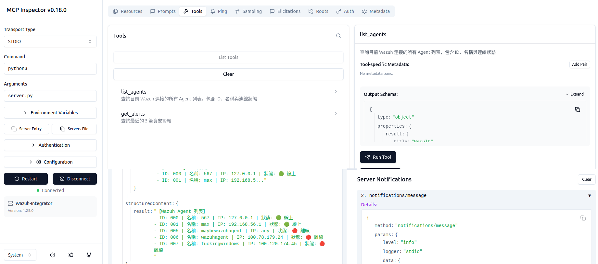
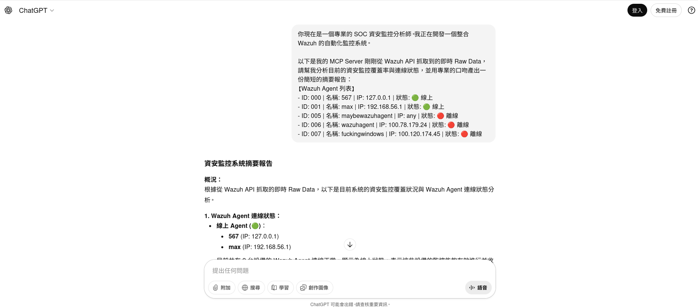
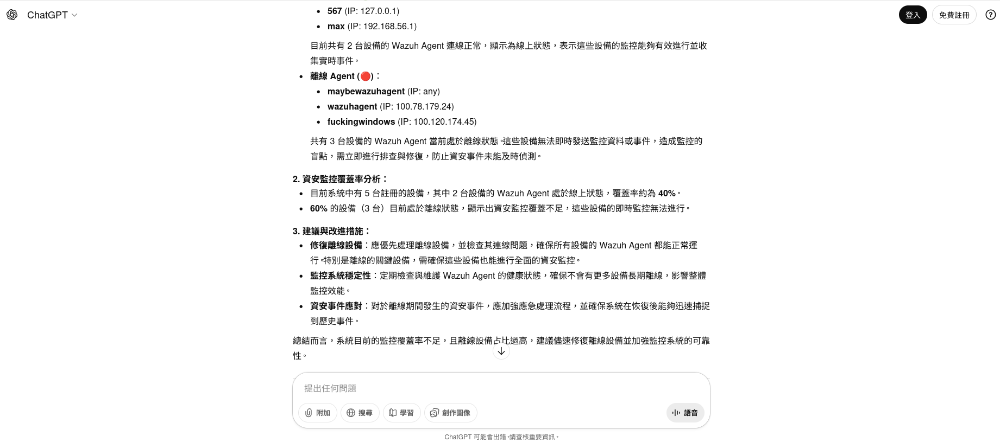

# Wazuh MCP Server Integration

## 專案簡介
本專案實作了一個基於 **Model Context Protocol (MCP)** 的中介伺服器，旨在連接 LLM (如 Claude/ChatGPT) 與企業級資安監控平台 **Wazuh**。

透過此整合，使用者可以使用自然語言與 Wazuh 進行互動，自動執行資安態勢查詢與威脅分析，實現「Chat with Security Data」的自動化維運目標。

## 功能特色
* **Agent 狀態監控**：即時查詢受監控端點的連線狀態 (Online/Offline) 與 IP 資訊。
* **警報分析**：自動擷取最新的資安警報 (Alerts)，供 AI 進行風險評估。
* **安全認證**：實作自動化 Token 獲取與 API 金鑰管理，支援自簽憑證 (Self-signed Cert) 環境。

## 技術架構
* **語言**：Python 3.10+
* **協定**：Model Context Protocol (MCP) SDK
* **整合目標**：Wazuh API (v4.x)
* **環境管理**：Virtualenv & Dotenv

## 安裝與執行
1. **安裝相依套件**：
   ```bash
   pip install -r requirements.txt

2. 設定環境變數： 請建立 .env 檔案並填入 Wazuh 連線資訊：
WAZUH_API_URL=[https://127.0.0.1:55000](https://127.0.0.1:55000)
WAZUH_USER=your_user
WAZUH_PASSWORD=your_password

3.啟動伺服器：
python3 server.py

成果展示 (Demo & Results)
### 1. 實際運作測試 (MCP Inspector)
下圖顯示 MCP Server 成功啟動，並透過 `list_agents` 工具從 Wazuh API 成功撈取即時監控數據：



### 2. AI 整合分析情境模擬 (AI Analysis)
本系統將抓取到的 Wazuh 原始數據 (Raw Data) 傳遞給 LLM (ChatGPT)，成功生成資安態勢報告。
下圖展示了完整的「數據獲取 -> AI 推論 -> 產出報告」流程：



